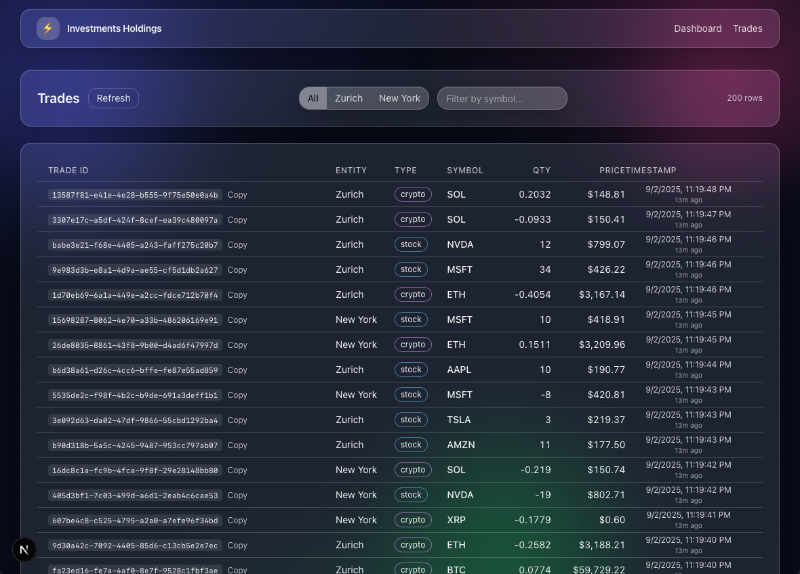

# Go Trades Processor

A small, composable system for **ingesting trade events**, **processing** them in Go, and exposing them to a **TypeScript frontend** for visualization and debugging. Ships with Docker Compose so you can run all services together.

## App Preview

<p align="center">
  
  <br/><br/>
  
</p>


---

## Features

- 📥 **Producer** service that emits trade events (mock/stream)
- ⚙️ **Backend** service in Go to validate, transform, and route events
- 💻 **Frontend** in TypeScript to inspect trades in real time
- 🐳 **Docker Compose** for easy, reproducible local runs
- 🔧 Modular, monorepo layout for hacking on each piece independently

---

## Tech Stack

- **Go** for the trade processor (backend) and producer
- **Next.js + TypeScript** for the frontend
- **Docker Compose** for multi-service orchestration


---

## Monorepo Layout

- **backend**: *Go service: process / serve trades*
- **producer**: *Trade event generator (mock or adapter)*
- **frontend**: *TypeScript UI with a dashboard*
- **docker-compose.yml**
- **README.md**

## How to Setup

Setup the following environment variables:


## How to run

*Please note the commands below will also spawn a producer instance that by default is gonna die after 1 minute (to avoid spamming the Docker Volume with trades until the local storage of the user is full 🫠 - You may check the Environment variables for the `producer` service in the `docker-compose.yml` file to change this behavior)*.


```sh
docker compose build --no-cache 
docker compose up --force-recreate
```

The Dashboard App will be accessible at [http://localhost:3000](http://localhost:3000)

The Kafka UI will be accessible at [http://localhost:8081/](http://localhost:8081/)


### Rebuild after changes

The following commands Rebuild services that have a build directive (`backend`, `frontend`, and `producer`) and Force recreate them

```sh
docker compose rm -fsv
docker compose down --rmi all
docker compose build --no-cache backend frontend producer
docker compose up -d --force-recreate
```